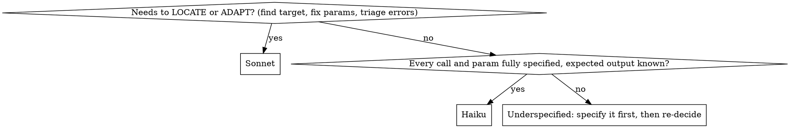

# Delegating Unity-MCP Work to a Cheaper Subagent

## Overview

**Core principle: the expensive model plans; a cheap subagent executes MCP and reads logs.**

Unity-MCP tool output is the most token-heavy thing in a Unity session — `read_console` with stacktraces, `get_hierarchy` dumps, paginated `find_gameobjects`, base64 screenshots, and NUnit `results.xml`. Running these inline on Opus/high effort burns tokens for work that needs almost no reasoning.

## The Rule (mandatory)

**Every Unity-MCP tool call MUST run inside a subagent. The main (Opus) context never invokes an `mcpforunity__*` tool directly.**

The main agent only *decides* the exact calls and *interprets* the distilled result. The subagent *executes* and *reads*. The raw dump never touches the main context.

**No exceptions:**
- Not for "just one quick call"
- Not for "I only need to read the console"
- Not for "it's a tiny state check"
- Not for "dispatching costs more than this one call" — consistency beats the micro-optimization; let a small read piggy-back on the next dispatch

If you catch yourself about to type an `mcpforunity__*` tool call in the main context, STOP and dispatch a subagent instead.

## Choosing the Model — decide in this order

Pick the **cheapest tier that can do the subtask**. Walk the questions top-down; the first "yes" picks the tier.



| Tier | Use **exactly** when | Concrete examples |
|------|----------------------|-------------------|
| **Haiku** (`model: "haiku"`) | You handed it a fully-specified command list (tools + all params) and you know what success looks like. Pure execute / read / grep-for-known-pattern. | Run a given `batch_execute`; `read_console` → errors only; poll `editor/state` until `is_compiling==false`; parse `results.xml` for pass/fail; read latest compile result from `Editor.log` |
| **Sonnet** (`model: "sonnet"`) | The subagent must make a small in-scope decision: find the correct GameObject/component, adapt a payload shape that varies by Unity version, or triage mixed/ambiguous console output. | `find_gameobjects` then pick the right instance and assign a SerializeField; describe a screenshot; decide which of several errors is the real one |
| **Opus** = the **main** agent. **Never run MCP here.** | Architecture, cross-result root-cause reasoning, deciding *what* to build, writing the dispatch spec. | Designing scene/script structure; root-causing across multiple results |

**Tie-breaker (Haiku vs Sonnet):** if *you* wrote every param → Haiku; if the subagent has to *go find* anything → Sonnet. Never reach for Opus to run MCP.

> The Claude Code `Agent` tool exposes a `model` choice, not an `effort` knob — so "lower effort" = lower model tier (Haiku/Sonnet) **plus** a tight, fully-specified prompt.

## Dispatch Pattern

The subagent is cheaper and less capable — **give it a precise spec, not a goal.** You (Opus) decide the exact tool calls and params; the subagent just runs them and reports.

**Read-only (console / logs / tests):** use the `Explore` subagent (read-only, has MCP read tools).

**Mutating (create/edit/wire):** use `general-purpose` (full MCP tools).

```
Agent(
  subagent_type="general-purpose",     # or "Explore" for read-only
  model="haiku",                       # "sonnet" if it needs to locate/adapt
  description="Run Unity MCP ops",
  prompt="""
  Execute these Unity-MCP commands EXACTLY, in order. Follow
  @unity-mcp-operator-guide and @unity-mcp-ignore.

  1. <exact tool + full params>
  2. <exact tool + full params>
  3. After edits: poll mcpforunity://editor/state until is_compiling==false,
     then read_console(types=["error","warning"], count=20).

  Return ONLY:
  - PASS/FAIL per step
  - any error/warning text (deduped)
  - the specific value(s) I asked for (instance_ids, job result, etc.)
  Do NOT paste raw hierarchy dumps, full console listings, or base64 images.
  Summarize screenshots in one or two sentences.
  """
)
```

## What the Subagent Returns

Distilled only. The main context should receive single-screen results, never raw dumps:
- ✅ "Step 3 FAIL — CS0246: `IInputService` not found in PlayerController.cs:12. Steps 1–2 OK."
- ✅ "All 14 EditMode tests passed. job_id done."
- ✅ "Screenshot: Player capsule is below the floor plane, partially clipping."
- ❌ The 400-line console listing, the full hierarchy JSON, or the base64 PNG.

If the subagent hits something needing Opus-level judgment (architectural ambiguity, a real bug to root-cause), it **returns the distilled facts and stops** — it does not improvise. You decide next, then dispatch again.

## Common Mistakes

| Mistake | Fix |
|---------|-----|
| Calling any `mcpforunity__*` tool in the main context | Forbidden — dispatch a subagent for every MCP call |
| Giving the subagent a vague goal ("set up the player") | Give exact tool calls + params; cheap models flail on open goals |
| Asking it to "return everything" | Specify the distilled output explicitly; that IS the saving |
| Pulling base64 screenshots into main | Have the subagent describe the image in text |
| Using Opus for MCP execution because it "feels safer" | Plan on Opus, execute on Haiku/Sonnet; that is the whole point |
| Subagent guessing on ambiguity | Instruct it to stop and report facts; Opus decides |

## Red Flags — STOP and dispatch instead

- "It's just one `read_console`, I'll do it here."
- "A tiny `editor/state` check isn't worth a subagent."
- "I'll run the MCP call inline and clean up the context later."
- "Dispatching costs more than this single call."
- "I need to see the raw output myself to decide."

**All of these mean: dispatch a subagent. The main context never calls `mcpforunity__*`.**

## Related Skills

- `@unity-mcp-operator-guide` — the MCP tool/resource reference the subagent follows
- `@unity-mcp-ignore` — mandatory scene/prefab guardrails (subagent must obey)
- `@unity-verify` — compile-check + Test Runner order (delegate the log/results read)
- `@using-subagents` — general delegation criteria and dispatch mechanics
